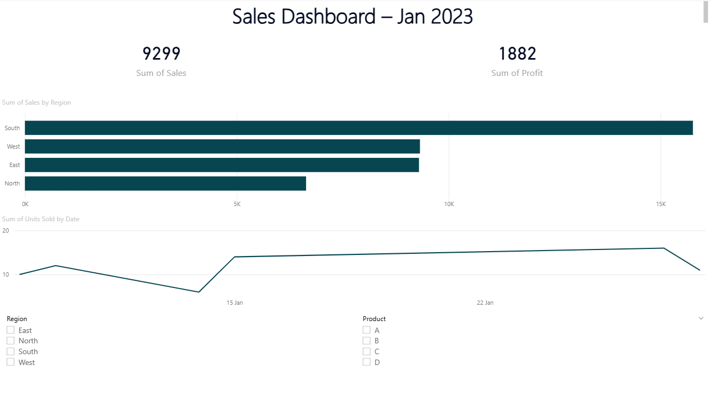

# 📊 Sales Performance Dashboard – Power BI

This is an interactive Sales Dashboard created using Power BI and Excel. It provides key business insights on total sales, profit, and units sold — with region-wise and product-wise performance tracking.

---

## 🔧 Tools & Technologies Used

- Microsoft Power BI Desktop
- Excel (for data)
- Power Query (ETL)
- DAX (for KPIs & Measures)

---

## 📁 Project Structure

| File Name                | Description                                       |
|--------------------------|---------------------------------------------------|
| `Sales_Dashboard.pbix`   | Power BI Dashboard file                          |
| `dataset.xlsx`           | Sample sales data for 30 days                    |
| `README.md`              | Project documentation                            |
| `Dashboard.png` | Dashboard preview image                    |

---

## 📸 Dashboard Preview

> 📍 Snapshot of the working dashboard 👇

---

## 📊 Dashboard Features

- 📍 Region-wise & Product-wise sales tracking  
- 📈 Time-based analysis (daily trends)  
- 💰 Total Sales, Profit, and Units Sold KPIs  
- 🧊 Interactive filters using slicers  
- 📑 Clean & professional layout with DAX measures

---

## 🗃 Sample Dataset Preview

| Date       | Region | Product | Sales | Profit | Units Sold |
|------------|--------|---------|-------|--------|-------------|
| 2023-01-01 | North  | A       | 1350  | 270    | 10          |
| 2023-01-02 | South  | C       | 1820  | 300    | 14          |
| 2023-01-03 | East   | D       | 1560  | 310    | 13          |
| ...        | ...    | ...     | ...   | ...    | ...         |

---

## ▶️ How to Run the Project

### 🖥 On Power BI Desktop:
1. Download [Power BI Desktop](https://powerbi.microsoft.com/en-us/desktop/)
2. Open `Sales_Dashboard.pbix`
3. If dataset is not loading, go to:
   - **Transform Data → Data Source Settings → Change Source**
   - Select `dataset.xlsx` file
4. Click **Refresh** to load visuals

---

> Built with 💛 Power BI & 📊 Excel by **Roshan Rana**
